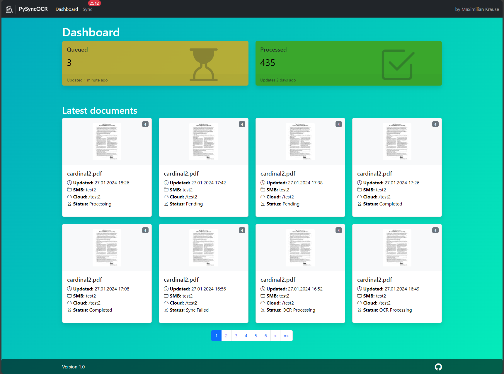

Welcome to PySyncOCR, a Python app that will
- Create a SMB server with custom targets
- OCR any new document in ENG and GER
- Sync your document to a location of choice within your OneDrive
- Have you let multiple sync targets

## Installation
1. Clone the repository using `git clone https://github.com/maxi07/PySyncOCR.git`
2. Cd into the directory using `cd PySyncOCR`
3. Install app using `sudo ./install.sh`

This will create a service that automatically starts when the server boots and runs the `main.py`, which will launch different threads for the webserver, the watchdog, the SMB server and the OCR.

To access the webserver, go to the servers ip and use port `5000`

The script will install the program and run a service `PySyncOCR` which will automatically run at boot. To disable, please run `sudo systemctl stop PySyncOCR`. To view live debug information, run `sudo journalctl -f -u PySyncOCR`.

> [!IMPORTANT]
> The installer was built for Ubuntu 22.04 LTS, but should work on other Linux distributions.

## Options
The program accepts some options, which have to be added in the `sudo nano /etc/systemd/system/PySyncOCR.service` service. The options are:
- `--dev` - to run the Flask server
- `--smb-port` to change the smb port

Change this line:
`ExecStart=/path/to/venv/bin/python3 /path/to/main.py --argument1 value1 --argument2 value2`

## Upcoming Features
- [ ] Notifications
- [x] Dashboard with KPIs
- [ ] SMB Settings
- [ ] SharePoint integration

## Development
For developing we can use the built-in Flask server. To get debug output and use flask, run the `main.py` from VSCode with the `--dev` option or use the preconfigured launch.json.
